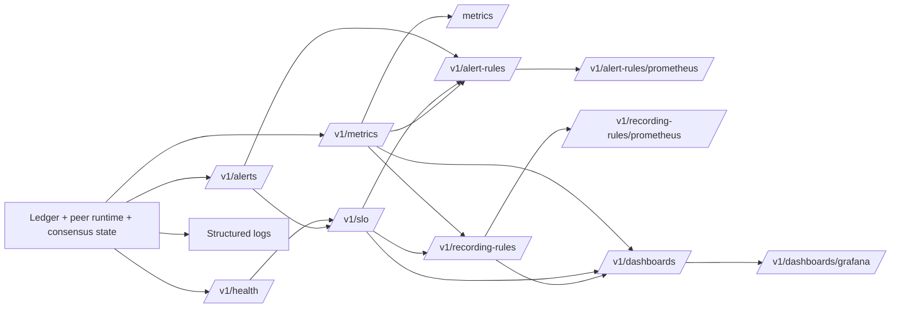

# Zephyr Chain MVP Architecture

## Overview

The current MVP is a five-part local development system:

- a Go node API that validates transactions, persists chain state, produces blocks, replicates state to configured peers, exposes machine-readable readiness, derived alerts, SLO-oriented objective summaries, JSON metrics, Prometheus-style scrape metrics, recommended alert and recording-rule bundles, recommended dashboard bundles, Grafana-oriented dashboard export, and can emit structured JSON incident logs
- a durable ledger that stores accounts, mempool entries, committed blocks, validator snapshots, active round state, proposals, votes, certificates, local consensus-action WAL state, import-recovery and snapshot-restore history, bounded consensus diagnostics, durable peer-sync incident history, derived peer-sync summaries, derived action or diagnostic metrics, and restart-safe metadata on disk
- a DPoS election module that ranks validators deterministically from candidate and vote inputs
- a consensus message and automation layer that validates signed proposals and votes, derives quorum certificates, tracks the active round, and drives the first timeout-driven automation flow
- a Vue wallet that runs in the browser and acts as a light client

The current data flow is:

`wallet UI -> wallet signing logic -> node HTTP API -> durable mempool -> block template -> self-contained proposal/vote/certificate artifacts -> manual or automated certified commit -> durable block/account state -> transport-backed peer replication`

The current consensus-artifact flow is:

`validator election -> durable validator snapshot -> durable active round state -> signed self-contained proposal -> signed votes -> quorum certificate -> optional gated block commit/import`

This is still a development-stage system. It now has an enforceable certified commit/import path, signed validator transport identity proofs, durable round state, and a first timeout-driven automation slice, but it is not yet a complete validator finality protocol. The scaling direction also stays staged: keep validator consensus and settlement on a single-chain control path first, use throughput instrumentation to measure real bottlenecks, and push future confidential-compute growth toward separate execution lanes or worker pools before considering full consensus sharding.

Current observability and export flow:

## Components

### Node API

The node entrypoint lives in `cmd/node/main.go` and starts an HTTP server from `internal/api`.

The API layer now handles:

- liveness through `GET /health`
- Prometheus-style scrape export through `GET /metrics`, including per-peer retained incident counts, latest observation timestamps, committed-chain throughput gauges plus rolling `1m`, `5m`, and `15m` TPS windows, and raw settlement queue-drain lag plus threshold, utilization-ratio, warn-normalized drain-estimate-pressure, and backlog-drain-estimate gauges
- derived readiness through `GET /v1/health`, including settlement queue-drain checks when automatic block production is enabled
- derived alerts through `GET /v1/alerts`, including settlement-throughput reduced or stalled signals when queued transactions outlive the expected block window
- derived SLO summaries through `GET /v1/slo`, including the settlement-throughput objective alongside readiness and peer-continuity summaries
- recommended alert-rule bundles through `GET /v1/alert-rules` and `GET /v1/alert-rules/prometheus`
- recommended recording-rule bundles through `GET /v1/recording-rules` and `GET /v1/recording-rules/prometheus`, including settlement-throughput state rollups, normalized settlement queue-drain utilization, projected queue-drain pressure, max projected queue-drain pressure, and queue-drain estimate rollups, the per-peer incident-pressure rollup used by the peer-sync dashboard, canonical recent-TPS rollups for the overview dashboard, and runtime-aware disabled reasons when a producing or synced role is not active
- recommended dashboard bundles through `GET /v1/dashboards` and `GET /v1/dashboards/grafana`, including settlement-throughput state, raw settlement queue-drain lag, normalized queue-drain utilization, recording-rule-backed estimated queue-drain pressure, a recording-rule-backed worst-case projected-pressure stat, recording-rule-backed estimated queue-drain time, and recent transaction throughput in the overview bundle plus peer incident-pressure drill-down by peer, with JSON metadata preserved for runtime-disabled panels and enabled-only Grafana export
- runtime status through `GET /v1/status`
- machine-readable observability through `GET /v1/metrics`, including structured settlement alert metadata, normalized queue-drain utilization ratios, recent backlog-drain estimates, and per-estimate warn utilization ratios
- peer visibility through `GET /v1/peers`, including admission, identity, live sync/repair telemetry, restart-safe import, snapshot, and replication-failure backfill from durable incidents, durable per-peer incident history, and derived per-peer incident counters
- consensus visibility through `GET /v1/consensus`
- validator election inputs through `POST /v1/election`
- the latest durable validator snapshot through `GET /v1/validators`
- signed proposals through `POST /v1/consensus/proposals`
- signed validator votes through `POST /v1/consensus/votes`
- persisted account state through `GET /v1/accounts/{address}`
- signed transaction envelopes through `POST /v1/transactions`
- committed blocks through `GET /v1/blocks/latest` and `GET /v1/blocks/{height}`
- development funding through `POST /v1/dev/faucet`
- deterministic next-block preview through `GET /v1/dev/block-template`
- manual local block production through `POST /v1/dev/produce-block`
- internal node sync through `POST /v1/internal/blocks` and `GET /v1/internal/snapshot`
- background block production, peer sync, and the first consensus automation loop when those features are enabled

### Peer Transport Layer

The current multi-node layer is hidden behind a transport abstraction.

Today the concrete implementation still uses static HTTP peer URLs, but the rest of the server no longer depends directly on raw HTTP calls for peer replication. The transport currently carries:

- accepted transactions
- dev faucet credits
- committed blocks
- signed proposals
- signed votes
- status fetches
- block fetches by height
- snapshot fetches for catch-up restore
- signed validator transport-identity headers on replicated POSTs when a validator private key is configured

This is an important production-preparation step because it gives the codebase a seam where authenticated libp2p networking can later replace the HTTP implementation. The current HTTP layer can already expose and verify validator identity proofs, enforce strict peer admission, pin configured peers to expected validators when the operator enables that policy, and surface per-peer sync state, repair metadata, retained replication-failure context, restart-safe incident backfill, and durable incident history through the peer view plus operator APIs.

### Durable Ledger

The durable local state lives in `internal/ledger` and is persisted as JSON under the configured node data directory.

The store currently persists:

- account balances and committed nonces
- queued mempool entries
- committed blocks
- known committed transaction IDs
- applied faucet request IDs used for idempotent peer funding replication
- the active validator snapshot selected by the latest election call
- active round height, round number, and round start time
- durable signed proposals
- durable signed validator votes with frozen voting power at record time
- durable quorum certificates built from vote power
- bounded recent consensus diagnostics for rejected proposal, vote, commit, and import paths, including peer-sync import failures
- derived per-height round history for proposal, vote, and certificate state across rounds
- derived block-readiness inspection for pending-height template, certificate, commit, and import readiness
- derived recovery summaries for pending replay, pending import backlog, successful local certified block commits, and the latest local snapshot restore
- bounded durable peer-sync incident history for repeated unreachable, unadmitted, replication-blocked, import-blocked, sync-error, and snapshot-restored peer states
- derived peer-sync summaries that roll those incidents up by peer, state, reason, and error code for operator inspection
- derived consensus-action and diagnostic metric buckets built from persisted WAL and rejection history for machine-readable observability

On startup, the node reloads this state and rebuilds pending balance and nonce reservations from the persisted mempool. Validator state, active round state, consensus artifacts, the local consensus-action WAL, and recent consensus diagnostics also survive restart. When the node applies a peer snapshot for catch-up, it now preserves its own local recovery, diagnostics, and peer-sync incident history instead of replacing that operator context with the peer's local WAL state.

The current ledger can derive a deterministic next block candidate from the current mempool plus chain tip. That candidate is what operators propose and certify in the manual flow, and once a proposal is stored the node can later replay that same candidate from proposal storage without depending on the mempool alone. When a certified local commit succeeds, the API layer now records that `block_commit` event back into the durable consensus-action history so the proposer path remains visible in recovery and metrics surfaces.

### Consensus Message And Automation Layer

The `internal/consensus` package introduces signed consensus messages, while `internal/api` now contains the first automation loop that drives proposer and voter behavior on the current devnet path.

Current message types:

- `Proposal`: signed by the scheduled proposer for a height and round and carrying the full candidate transaction body
- `Vote`: signed by a validator for a proposed block hash at a height and round

Current validation rules:

- the signer address must match the submitted public key
- the signature must verify with P-256 over the canonical payload
- the proposal or vote must target the node's next block height
- the active proposer is derived from both height and round
- the proposal `previousHash` must match the current chain tip
- the proposal `blockHash` must match the signed `producedAt` plus ordered `transactionIds`
- the proposal transaction body must be present and must match those `transactionIds`
- the proposer must match the scheduled proposer for that height and round
- the voter must belong to the active validator set
- stale lower-round messages are rejected once the node has advanced to a newer round
- valid higher-round messages can pull a slower node onto that newer round
- votes must reference a known proposal

When a vote set for a block hash reaches the `>2/3` voting-power threshold, the node persists a quorum certificate artifact.

If `ZEPHYR_REQUIRE_CONSENSUS_CERTIFICATES=true`, the node uses those artifacts to gate both local block commit and remote block import. The gate checks the exact proposal template fields through the shared block hash path, not just an opaque hash string.

If `ZEPHYR_ENABLE_CONSENSUS_AUTOMATION=true`, the current automation loop can:

- start and persist an active round timer
- let the scheduled proposer build the next block template and self-submit a proposal
- let active validators self-submit a vote for the latest known proposal in that round
- advance the round after `ZEPHYR_CONSENSUS_ROUND_TIMEOUT`
- rotate the proposer for the same height when the round changes
- let the new proposer reuse the latest stored candidate body for that height
- let the scheduled proposer auto-commit once a matching quorum certificate exists and certificate enforcement is enabled
- send automated proposals before automated votes so peers do not observe vote-before-proposal races on the happy path
- rebroadcast the latest stored local proposal and latest stored local vote for the pending height until the matching certificate exists
- persist locally authored proposals and votes into a bounded restart-safe consensus-action WAL with replay-attempt metadata
- expose round-evidence state, per-height round history, block readiness, deadlines, leading tallies, quorum remaining, warning flags, local vote presence, certificate presence, local recovery state, pending import backlog, recent snapshot-restore metadata, recent rejection diagnostics, durable peer-sync history, derived peer-sync summary, machine-readable JSON metrics, Prometheus-style scrape metrics including per-peer retained incident pressure, derived readiness checks, derived alert state, SLO-oriented objective summaries, and recommended alert, recording-rule, or dashboard bundles through the status, consensus, block-template, `/v1/metrics`, `/metrics`, `/v1/health`, `/v1/alerts`, `/v1/slo`, `/v1/alert-rules`, `/v1/alert-rules/prometheus`, `/v1/recording-rules`, `/v1/recording-rules/prometheus`, `/v1/dashboards`, and `/v1/dashboards/grafana` APIs

If `ZEPHYR_VALIDATOR_PRIVATE_KEY` is configured, the API layer also derives a signed transport identity for the local validator and verifies peer proofs exposed through `GET /v1/status`. When `ZEPHYR_REQUIRE_PEER_IDENTITY` or `ZEPHYR_PEER_VALIDATORS` is configured, replicated peer POST requests must satisfy that admission policy before they are accepted.

## Current Production Gap

The repository has moved from consensus-preparation-only into certificate-gated commit/import with concrete template commitments, durable round state, and a first timeout-driven proposer rotation loop, but it still falls short of production finality in several important ways:

- validator nodes can now prove identity and enforce peer admission over the current transport, but peer discovery is still static HTTP configuration rather than authenticated libp2p
- automation can now rotate proposers on timeout, rebroadcast the latest local proposal or vote after link recovery, and replay persisted local proposal or vote actions after restart
- the current operator surface is materially better through round warnings, per-height round history, block readiness, replay and import backlog visibility, durable peer-sync history, derived cross-peer summary with state, reason, and error-code rollups, JSON metrics, Prometheus `/metrics`, `/v1/health`, `/v1/alerts` including targeted peer import, admission, and replication warnings, `/v1/slo`, `/v1/alert-rules`, `/v1/alert-rules/prometheus`, `/v1/recording-rules`, `/v1/recording-rules/prometheus`, `/v1/dashboards`, `/v1/dashboards/grafana`, structured event logs, snapshot-restore history, leading tallies, and bounded rejection diagnostics, but it is still too thin for full production incident handling across transport, peer-import, longer-horizon retention, broader dashboard coverage, and broader recovery scenarios
- broader consensus recovery coverage is still needed beyond the current local proposal, vote, and certified block-commit WAL plus import-repair and snapshot-recovery path

That is why the project has moved beyond replicated prototype, but it is still not a production blockchain.

